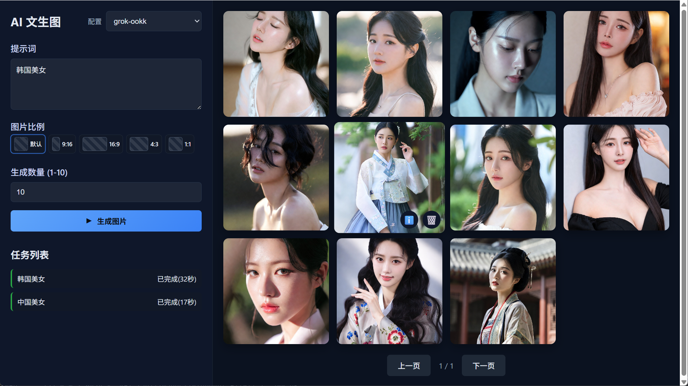

# AI Image Generation Website

基于 FastAPI + SQLite 的 AI 文生图网站。



## 功能特性

- 🎨 文本生成图片：输入提示词生成 AI 图片
- 📋 任务队列：可配置并发任务管理，支持排队
- 🖼️ 图片管理：网格展示、分页浏览、全屏预览
- 💾 历史记录：SQLite 存储，支持查询提示词
- ⚙️ 配置切换：从后端配置文件加载多套 API 配置

## 快速开始

### 1. 安装依赖

```bash
pip install -r requirements.txt
```

### 2. 配置 API

参考 `data/configs.json.sample`，重命名为 `data/configs.json`，再修改其中的 API 地址与密钥。
页面标题右侧下拉框可选择当前使用的配置。

### 3. 启动服务

```bash
python app.py
```

或使用 uvicorn：

```bash
uvicorn app:app --reload --port 8989
```

### 4. 访问网站

打开浏览器访问：http://localhost:8989

## 项目结构

```
aigpic/
├── app.py              # FastAPI 主应用
├── requirements.txt    # Python 依赖
├── data/
│   ├── app.db          # SQLite 数据库文件
│   └── configs.json    # API 配置文件
├── sql/
│   └── init.sql        # 数据库初始化脚本
├── src/
│   ├── __init__.py
│   ├── db.py           # SQLite 数据库操作
│   ├── client.py       # 外部 API 客户端
│   └── tasks.py        # 任务队列管理
├── static/
│   ├── index.html      # 前端页面
│   ├── app.js          # 前端逻辑
│   └── styles.css      # 样式文件
├── output/             # 生成的图片存储目录
└── doc/
    └── report.md       # 技术报告
```

## 技术栈

- **后端**: FastAPI + Uvicorn
- **数据库**: SQLite
- **HTTP 客户端**: httpx
- **前端**: 原生 HTML/CSS/JavaScript

## License

MIT
